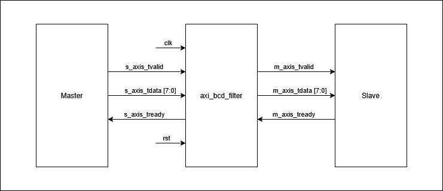
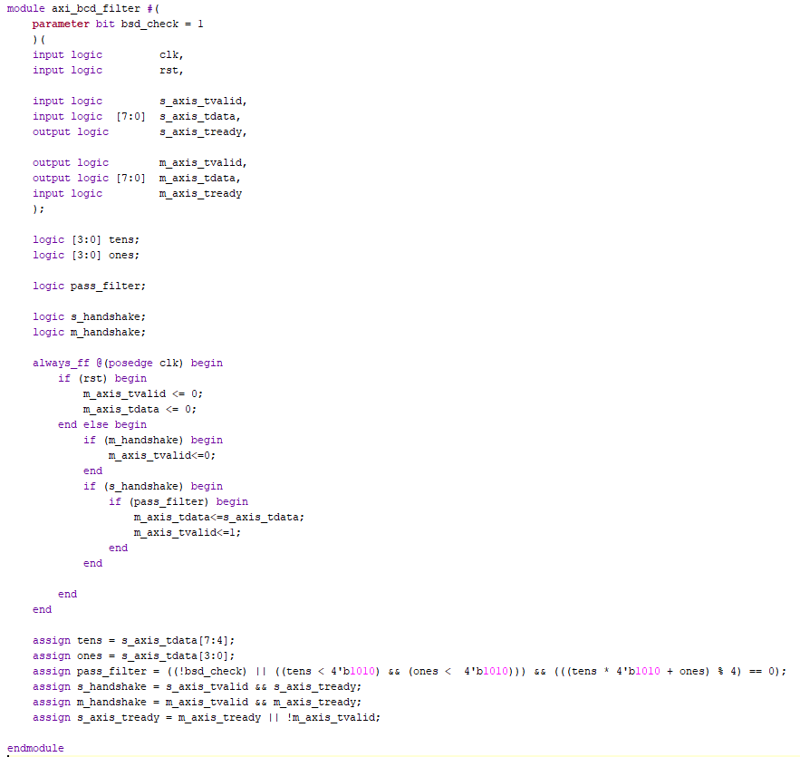
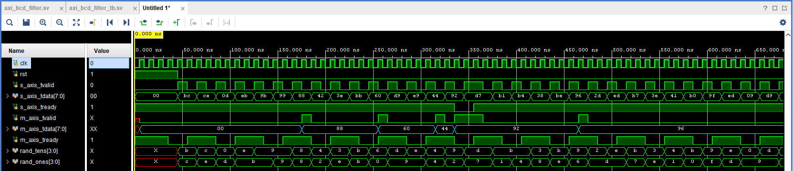
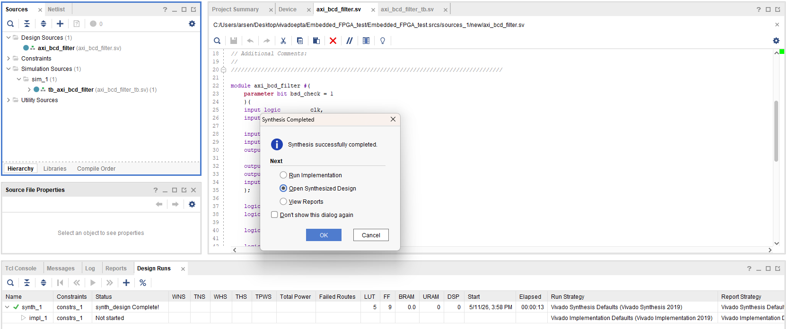

# AXI4-Stream BCD Div4 Filter

Тестовое задание на летнюю стажировку в **Импульс от Ядра**.

Проект реализует фильтр AXI4-Stream потока на **SystemVerilog**.  
Модуль принимает 8-битные значения в формате **BCD** и пропускает на выход только те значения, которые делятся на 4 без остатка.

---

## Используемые инструменты

- Язык: **SystemVerilog**
- Среда разработки: **Xilinx Vivado**
- Целевая ПЛИС: **x7a100tcsg324-1**
- Интерфейс: **AXI4-Stream**

---

## Структура проекта

```text
axi_bcd_filter/
├── rtl/
│   └── axi_bcd_filter.sv
├── tb/
│   └── axi_bcd_filter_tb.sv
├── screenshots/
│   ├── structure.png
│   ├── axi_bcd_filter.png
│   ├── waveform.png
│   └── syn.png
├── README.md
└── .gitignore
```

---

## Структурная схема

Модуль `axi_bcd_filter` расположен между AXI4-Stream master и AXI4-Stream slave.

```text
Master -> axi_bcd_filter -> Slave
```

Master генерирует входной поток данных.  
Фильтр принимает данные через `s_axis_*`, обрабатывает их и передаёт подходящие значения дальше через `m_axis_*`.  
Slave принимает отфильтрованный поток и управляет сигналом `m_axis_tready`.



---

## Описание задания

Необходимо реализовать модуль, который работает как фильтр AXI4-Stream потока.

На вход поступают 8-битные значения в формате BCD:

```text
s_axis_tdata[7:4] — десятки
s_axis_tdata[3:0] — единицы
```

Примеры корректных BCD-значений:

```text
8'h00 = 0
8'h04 = 4
8'h12 = 12
8'h24 = 24
8'h99 = 99
```

Примеры некорректных BCD-значений:

```text
8'h1A
8'hA0
8'h2F
8'hFF
```

Так как в BCD каждая цифра должна быть от `0` до `9`, значения `A..F` считаются некорректными.

---

## Принцип работы

Модуль принимает входные данные через интерфейс:

```text
s_axis_tvalid
s_axis_tready
s_axis_tdata
```

И выдаёт отфильтрованные данные через интерфейс:

```text
m_axis_tvalid
m_axis_tready
m_axis_tdata
```

Передача данных происходит только при выполнении условия AXI4-Stream handshake:

```systemverilog
tvalid && tready
```

Если число корректное и делится на 4, оно передаётся на выход.  
Если число не делится на 4 или является некорректным BCD, оно отбрасывается.

Пример:

```text
Вход:  00, 01, 02, 03, 04, 05, 08, 12, 1A, FF, 16
Выход: 00, 04, 08, 12, 16
```

---

## Проверка делимости на 4

BCD-число переводится в обычное десятичное значение:

```systemverilog
value = tens * 10 + ones;
```

После этого проверяется остаток от деления на 4:

```systemverilog
value % 4 == 0
```

В коде условие фильтрации реализовано через сигнал `pass_filter`.

---

## Поддержка backpressure

Модуль поддерживает ситуацию, когда выходной приёмник временно не готов принимать данные.

Если:

```systemverilog
m_axis_tvalid = 1
m_axis_tready = 0
```

то выходные данные удерживаются на `m_axis_tdata`, пока не произойдёт успешная передача:

```systemverilog
m_axis_tvalid && m_axis_tready
```

Сигнал `s_axis_tready` не является константой. Он зависит от состояния выходного интерфейса:

```systemverilog
s_axis_tready = m_axis_tready || !m_axis_tvalid;
```

Это позволяет останавливать входной поток, если внутри модуля уже есть данные, ожидающие передачи на выход.

---

## Параметр проверки BCD

В модуле есть параметр:

```systemverilog
parameter bit bsd_check = 1
```

Если `bsd_check = 1`, модуль проверяет корректность BCD-значения.  
Если `bsd_check = 0`, проверка BCD отключается.

Некорректные BCD-значения отбрасываются при включённом параметре `bsd_check`.

---

## Интерфейс модуля

```systemverilog
module axi_bcd_filter #(
    parameter bit bsd_check = 1
)(
    input  logic       clk,
    input  logic       rst,

    input  logic       s_axis_tvalid,
    input  logic [7:0] s_axis_tdata,
    output logic       s_axis_tready,

    output logic       m_axis_tvalid,
    output logic [7:0] m_axis_tdata,
    input  logic       m_axis_tready
);
```

---

## Сигналы

| Сигнал | Направление | Описание |
|---|---|---|
| `clk` | input | Тактовый сигнал |
| `rst` | input | Синхронный сброс |
| `s_axis_tvalid` | input | Валидность входных данных |
| `s_axis_tdata[7:0]` | input | Входное BCD-значение |
| `s_axis_tready` | output | Готовность модуля принять входные данные |
| `m_axis_tvalid` | output | Валидность выходных данных |
| `m_axis_tdata[7:0]` | output | Выходное BCD-значение |
| `m_axis_tready` | input | Готовность приёмника принять выходные данные |

---

## Основная логика модуля

Внутри модуля выделяются десятки и единицы:

```systemverilog
assign tens = s_axis_tdata[7:4];
assign ones = s_axis_tdata[3:0];
```

Условие прохождения фильтра:

```systemverilog
assign pass_filter =
    ((!bsd_check) || ((tens < 4'd10) && (ones < 4'd10))) &&
    (((tens * 4'b1010 + ones) % 4) == 0);
```

Условия handshake:

```systemverilog
assign s_handshake = s_axis_tvalid && s_axis_tready;
assign m_handshake = m_axis_tvalid && m_axis_tready;
```

Формирование готовности входного интерфейса:

```systemverilog
assign s_axis_tready = m_axis_tready || !m_axis_tvalid;
```

---

## RTL-код в Vivado

Скриншот модуля `axi_bcd_filter` в Vivado:



---

## Testbench

Для проверки был написан testbench `axi_bcd_filter_tb.sv`.

Testbench:

- генерирует случайные входные значения;
- подаёт как корректные BCD-значения, так и значения с цифрами `A..F`;
- выводит входные и выходные данные в консоль симуляции;
- проверяет работу при изменении `m_axis_tready`;
- позволяет наблюдать удержание выходных данных при backpressure.

---

## Результаты симуляции

На waveform видно:

- входные данные `s_axis_tdata`;
- сигнал `s_axis_tvalid`;
- сигнал `s_axis_tready`;
- выходные данные `m_axis_tdata`;
- сигнал `m_axis_tvalid`;
- сигнал `m_axis_tready`;
- случайные BCD и некорректные BCD-значения;
- передачу только подходящих значений на выход.



---

## Синтез в Vivado

Проект был успешно синтезирован в **Xilinx Vivado**.

Выбранная целевая ПЛИС:

```text
x7a100tcsg324-1
```

Скриншот успешного синтеза:



---

## Основные особенности реализации

- Используется синхронный сброс.
- Выходные данные хранятся в регистрах.
- Поддерживается AXI4-Stream handshake.
- Поддерживается backpressure.
- `s_axis_tready` формируется не как константа.
- Некорректные BCD-значения отбрасываются при включённом параметре `bsd_check`.
- Порядок прошедших фильтр данных сохраняется.
- Валидные данные не теряются при временной неготовности выходного приёмника.

---

## Как запустить проект

1. Открыть проект в **Vivado**.
2. Добавить RTL-файл:

```text
rtl/axi_bcd_filter.sv
```

3. Добавить testbench:

```text
tb/axi_bcd_filter_tb.sv
```

4. Запустить симуляцию:

```text
Run Simulation
```

5. Проверить waveform.
6. Запустить синтез:

```text
Run Synthesis
```

7. Убедиться, что синтез завершился успешно.

---

## Автор

Тестовое задание выполнил: **Arsen Petrov**
